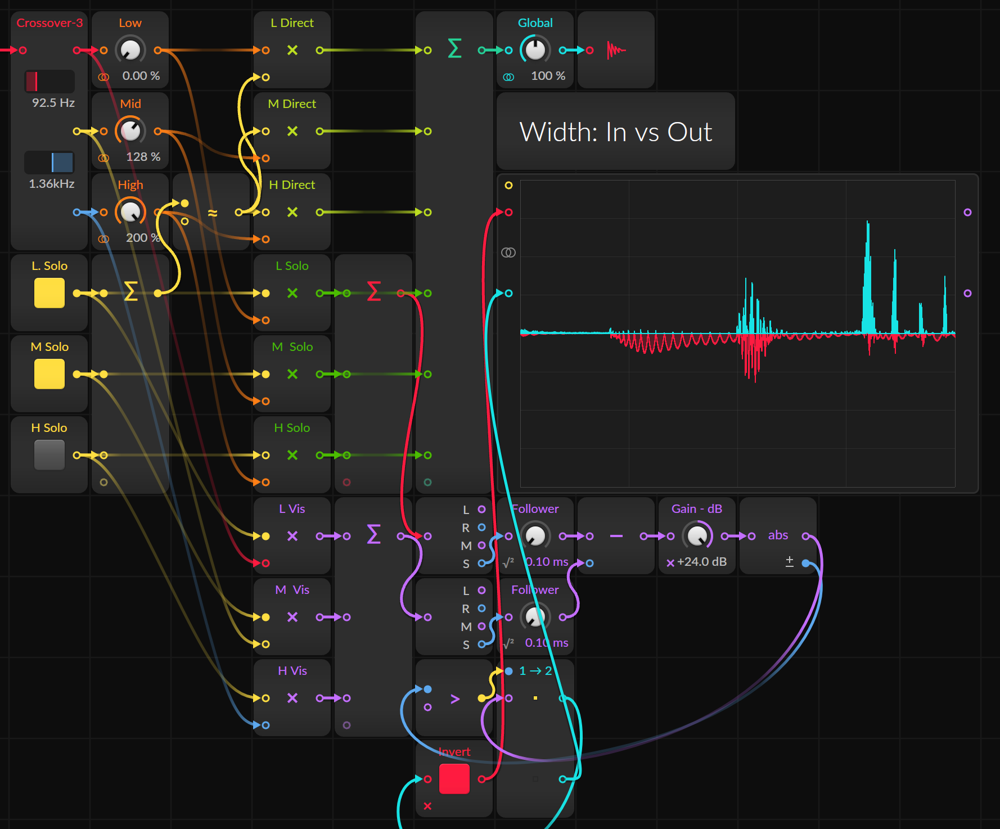
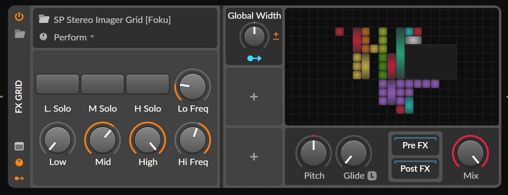

```toml
date = "2024-12-11"
giscus = "A1X-5bc"
```

# Stereo Imager

{:sp-list:}
| | | | |
|-|-|-|-|
| Version | 2024.12.11 | ID | GGdz |
| Bitwig Version | 5.3 | Type | FX Grid |

{:sp-download:}
[Download](https://raw.githubusercontent.com/rhizoome/bitbook/refs/heads/main/Library/Presets/FX%20Grid/RH%20Stereo%20Imager%20Grid%20%5BGGdz%5D.bwpreset) 


This multi-band stereo imager is designed to process audio by splitting the
frequency spectrum into distinct bands (low, mid, and high) using Bitwig’s
Crossover-3 device. Once divided, each band’s stereo width - the perceived
spatial distance of panned sound sources - can be adjusted individually. After
these adjustments, the bands are seamlessly recombined.

Crossover filters are specially designed to recombine without overlap or phase
changes.

<div class="sp-float-right">

<br>



{:sp-caption:}
[click to zoom]

</div>

## Key Features

- Per band visualisation of stereo image change
  - Red: Narrowing
  - Turquoise: Widening
- Mastering
	- Narrow stereo image in sub-bass range for enhanced acoustic impact and
	  reduced phase interactions in a room
	-	Widen stereo image in mid and high range for a more immersive experience
- Individual tracks
	-	Creative mixing and shaping stereo image
	- Similar to the Haas effect, widening the stereo image can lift a track
	  above the mix, adding depth and clarity
	-	Reduce extreme swings caused by automated or algorithmic panning

## Controls



{:sp-list:}
| | |
|-|-|
| Low / Mid / High Solo | **Solo the indicated bands**. Isolated listening of the selected bands |
| Low / Mid / High | **Adjust stereo width in percent**. 0% - 100% decrese stereo with, 100% - 200% increase stereo width |
| Global width | Adjust stereo width in percent after bands have been combined |
| Low Freq | Crossover-frequency between low and mid band |
| High Freq | Crossover-frequency between high and mid band |


## License

<p xmlns:cc="http://creativecommons.org/ns#" xmlns:dct="http://purl.org/dc/terms/"><a property="dct:title" rel="cc:attributionURL" href="https://bitbook.rhizoome.ch/effects/stereo_imager.html">RH Stereo Imager Grid [GGdz]</a> by <a rel="cc:attributionURL dct:creator" property="cc:attributionName" href="https://rhizoome.ch">Jean-Louis Fuchs</a> is licensed under <a href="https://creativecommons.org/licenses/by/4.0/?ref=chooser-v1" target="_blank" rel="license noopener noreferrer" style="display:inline-block;">Creative Commons Attribution 4.0 International</a></p>
