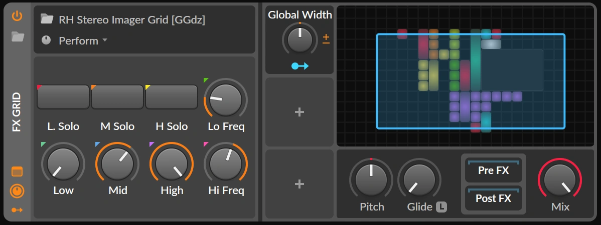

# Stereo Imager

| | | | |
|-|-|-|-|
| Update | 2024-12-10 | ID | GGdz |
| Bitwig Version | 5.2 | Type | FX Grid |

This multi-band stereo imager is designed to process audio by splitting the
frequency spectrum into distinct bands (low, mid, and high) using Bitwig’s
Crossover-3 device. Once divided, each band’s stereo width - the perceived
spatial distance of panned sound sources - can be adjusted individually. After
these adjustments, the bands are seamlessly recombined.

Crossover filters are specially designed to recombine without overlap or phase
changes.

 

\[click to zoom\]

## Key Features

- Mastering
	- Narrow stereo image in sub-bass range for enhanced acoustic impact and
	  reduced phase interactions in a room
	-	Widen stereo image in mid and high range for a more immersive experience
- Individual tracks
	-	Creative mixing and shaping stereo image
	- Similar to the Haas effect, widening the stereo image can lift a track
	  above the mix, adding depth and clarity
	-	Reduce extreme swings caused by automated or algorithmic panning

## Controls

| | |
|-|-|
| Low / Mid / High Solo | **Solo the indicated bands**. Isolated listening of the selected bands |
| Low / Mid / High | **Adjust stereo width in percent**. 0% - 100% decrese stereo with, 100% - 200% increase stereo width |
| Low Freq | Crossover-frequency between low and mid band |
| High Freq | Crossover-frequency between high and mid band |

